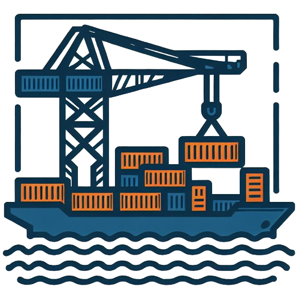

<p align="center">
    <picture>
      
    </picture>
</p>

# BrowserKube

## Description
Browsers Kubernetes Operator with WebDriver, Playwright and DevTools support 
## Development
### How-to run locally
1. Make sure your local Kubernetes cluster is up and running
2. Maksu sure `docker`, `kubectl`, `kustomize`, `skaffold`
3. Make sure [Skaffold](https://skaffold.dev/) is installed
4. Make sure that ingress controller is installed in your K8S cluster 
5. Execute
for development mode
```shell
#using task for amd64
task skaffold:dev -- -p amd64
#using skaffold directly for amd64
skaffold dev -p amd64
#using task for arm64
task skaffold:dev -- -p arm64
#using skaffold directly for arm64
skaffold dev -p arm64
```
or production mode
```shell
#using task
task skaffold:prod
#using skaffold directly
skaffold run
```


### How-to build images
1. Adjust configuration in `skaffold.yaml` file (if needed)
2. Set base docker registry by exporting env variable
```
export SKAFFOLD_DEFAULT_REPO=<your-registry-host-port-path>
#export SKAFFOLD_INSECURE_REGISTRY=<your-registry-host-port>
```
3. Execute skaffold build

### How-to install
You are two options of installing Helm chart
1. Manually. Helm Chart is located in `.ci/charts/browserkube` directory
2. Via Skaffold with automatic build of docker images. Adjust Skaffold configuration, set docker registry env variable and execute
```
skaffold run
```